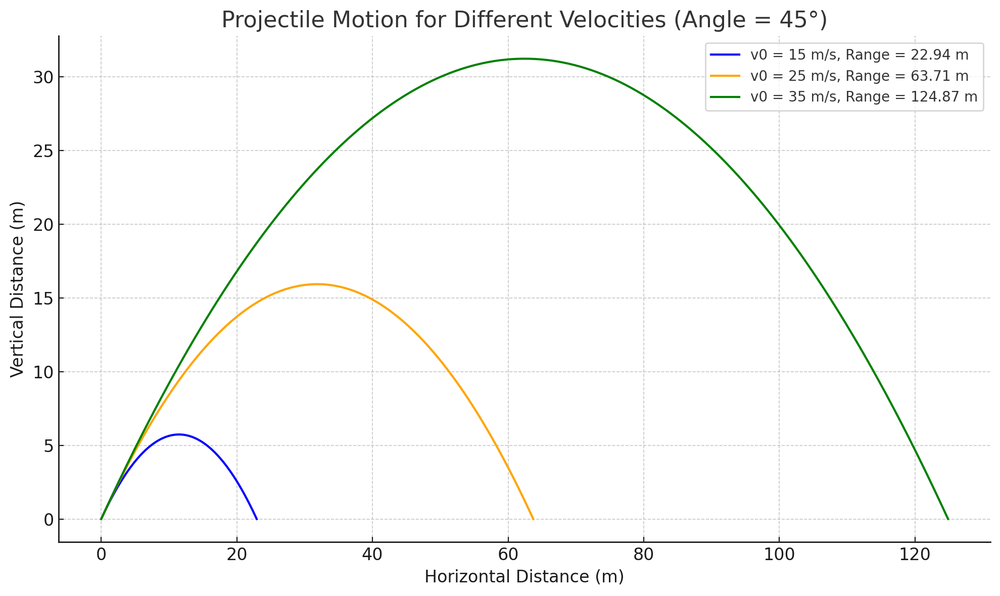

# Problem 1
# Projectile Motion Simulation

## 1. Introduction

### Purpose of the Study
In this report we will be studying the motion of a projectile. The goal of this study is to develop a clear mathematical model that describes how different factors, like the angle of launch and initial velocity,affect the range and trajectory of the projectile.

## 2. Theoretical Foundation

### 2.1 Governing Equations of Motion

There are basic equations that govern the motion of a projectile. These equations describe the horizontal and vertical displacements over time, considering an initial velocity and launch angle.

# Derivation of Governing Equations of Motion

## 1. Horizontal Motion
In projectile motion, the horizontal velocity remains constant (neglecting air resistance). The horizontal displacement is given by:

$$ 
x = v_0 \cos(\theta) t 
$$

where:
- $v_0$ is the initial velocity,
- $\theta$ is the launch angle,
- $t$ is time.

## 2. Vertical Motion
The vertical motion is influenced by gravity, leading to the following equation:

$$ 
y = v_0 \sin(\theta) t - \frac{1}{2} g t^2 
$$

where:
- $g$ is the acceleration due to gravity.

The velocity in the vertical direction changes over time:

$$ 
v_y = v_0 \sin(\theta) - g t 
$$

The time of flight, range, and maximum height can be derived from these equations.

## 3. Family of Solutions
The trajectory of a projectile depends on two initial conditions: the initial velocity $v_0$ and the launch angle $\theta$. These parameters lead to a **family of solutions**, meaning the trajectory varies based on different values of $v_0$ and $\theta$.

### **Key Observations**
- Varying $v_0$ changes **speed and range**.
- Varying $\theta$ affects **trajectory shape**, with the optimal angle for maximum range being $45^\circ$.

By adjusting $v_0$ and $\theta$, we  can control the projectile's motion, optimizing for **distance, height, or speed** depending on the scenario.

### Practical applications
  - It is important in sports such as basketball , discus and javelin to optimize angles for maximum range
  - useful in aerospace and engineering

# Calculating Projectile Range at Different Angles

## **Range Formula**
$$\begin{aligned}
R &= \text{range (meters)} \\
v_0 &= \text{initial velocity (m/s)} \\
\theta &= \text{launch angle (degrees)} \\
g &= 9.81 \text{ m/s}^2 \text{ (acceleration due to gravity)}
\end{aligned}$$
---

## **Example 1**  

$$ v_0 = 18 \text{ m/s}, \quad \theta = 35^\circ $$  

$$
R = \frac{(18)^2 \times \sin(2 \times 35^\circ)}{9.81}
$$

$$
R = \frac{324 \times \sin(70^\circ)}{9.81}
$$

$$
R = \frac{324 \times 0.9397}{9.81}
$$

$$
R \approx \frac{304.5}{9.81}
$$

$$
R \approx 31.0 \text{ meters}
$$

---

## **Example 2**  

$$ v_0 = 22 \text{ m/s}, \quad \theta = 50^\circ $$  

$$
R = \frac{(22)^2 \times \sin(2 \times 50^\circ)}{9.81}
$$

$$
R = \frac{484 \times \sin(100^\circ)}{9.81}
$$

$$
R = \frac{484 \times 0.9848}{9.81}
$$

$$
R \approx \frac{476.9}{9.81}
$$

$$
R \approx 48.6 \text{ meters}
$$

---

1. **For the same velocity, increasing the angle affects range differently.**  
2. **The maximum range occurs at 45**  
3. **Higher velocity results in a longer range.**  

## Phython Script for plotting graph
```python
```import numpy as np
import matplotlib.pyplot as plt

# Constants
g = 9.81  # Gravity (m/s²)
angles = np.linspace(0, 90, 100)  # Angles from 0° to 90°

# Initial velocities to compare
velocities = [10, 20, 30]  # m/s

# Function to calculate range
def calculate_range(v0, theta):
    return (v0**2 * np.sin(2 * np.radians(theta))) / g

# Plot range vs. angle for different velocities
plt.figure(figsize=(8, 5))

for v0 in velocities:
    ranges = calculate_range(v0, angles)
    plt.plot(angles, ranges, label=f"$v_0$ = {v0} m/s")

# Graph Formatting
plt.xlabel("Launch Angle (°)")
plt.ylabel("Range (m)")
plt.title("Projectile Range vs. Angle")
plt.legend()
plt.grid(True)

# Show the graph
plt.show()
```


# Projectile Range vs. Angle

## Description
The graph illustrates the relationship between the launch angle and the projectile range (m) for different initial velocities. The three curves represent:

**Blue Curve:**  
$ v_0 $= 10  m/s  

**Orange Curve:**  
$ v_0 $= 20  m/s  

**Green Curve:**  
$ v_0 $ = 30 m/s  


### Observations:
- The range increasess with angle up to **45°**, after which it decreases symmetrically.  
- Higher initial velocity results in a greater range.  
- The maximum range occurs at **45°** for all velocities.  

## Key Equation:
The projectile range  R  (ignoring air resistance) is given by:

$$
R = \frac{v_0^2 \sin(2\theta)}{g}
$$

where:
- R = range
- v = velocity   
- g = 9.81 m/s² is the acceleration due to gravity.


## Limitations:
1. **No Air Resistance Considered** – The graph assumes ideal projectile motion in a vacuum.  
2. **No Wind Effects** – External forces like wind resistance are ignored.  
3. **No Spin or Magnus Effect** – Rotational forces affecting range are not considered.  
4. **Constant Acceleration Due to Gravity** – Assumes a uniform gravitational field (\( g = 9.81 \) m/s²).  

## Range changing at different angles


## Range changing at different velocities



## Effects of Air Resistance


