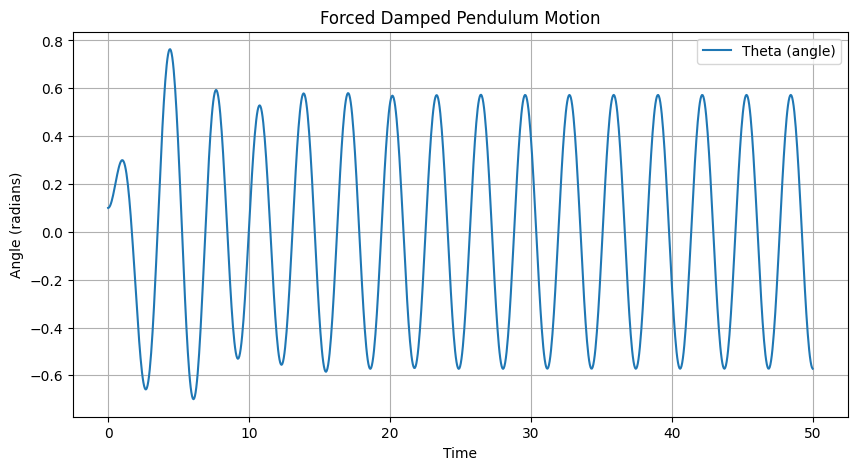

# Problem 2
# Problem: Forced Damped Pendulum Simulation

## 1. Introduction

### Purpose of the Study
In this report, we will study the motion of a forced damped pendulum. The goal is to develop a clear mathematical model describing how different factors—such as damping, external forcing, and initial conditions—affect the pendulum's behavior, including resonance, quasiperiodicity, and chaotic motion. 

## 2. Theoretical Foundation

### 2.1 Governing Equations of Motion
The forced damped pendulum follows a nonlinear second-order differential equation:

$$
\ddot{\theta} + \gamma \dot{\theta} + \omega_0^2 \sin\theta = A \cos(\omega t)
$$

where:
- \(\theta\) is the angular displacement,
- \( \gamma \) is the damping coefficient,
- \( \omega_0 \) is the natural frequency,
- \( A \) is the amplitude of the external force,
- \( \omega \) is the driving frequency.

For small angles (\( \theta \approx \sin\theta \)), the equation simplifies to:

$$
\ddot{\theta} + \gamma \dot{\theta} + \omega_0^2 \theta = A \cos(\omega t)
$$

which allows for analytical solutions to explore resonance conditions and energy behavior.

## 3. Numerical Simulation
To explore the full nonlinear dynamics, we rewrite the second-order differential equation as a system of first-order equations:

$$
\frac{d\theta}{dt} = v
$$
$$
\frac{dv}{dt} = - \gamma v - \omega_0^2 \sin\theta + A \cos(\omega t)
$$

Using Python, we integrate these equations using `odeint` from `scipy.integrate`.

### Python Implementation
```python
import numpy as np
import matplotlib.pyplot as plt
from scipy.integrate import odeint

def pendulum_equations(y, t, gamma, omega0, A, omega):
    theta, v = y
    dydt = [v, -gamma * v - omega0**2 * np.sin(theta) + A * np.cos(omega * t)]
    return dydt

# Parameters
gamma = 0.5  # Damping coefficient
omega0 = 1.5  # Natural frequency
A = 1.2       # Driving force amplitude
omega = 2.0   # Driving frequency

# Initial conditions
y0 = [0.1, 0]  # Initial angle and velocity

t = np.linspace(0, 50, 1000)  # Time array

# Solve ODE
y = odeint(pendulum_equations, y0, t, args=(gamma, omega0, A, omega))

# Plot results
plt.figure(figsize=(10, 5))
plt.plot(t, y[:, 0], label='Theta (angle)')
plt.xlabel('Time')
plt.ylabel('Angle (radians)')
plt.title('Forced Damped Pendulum Motion')
plt.legend()
plt.grid()
plt.show()
```


## 4. Analysis of Dynamics

### 4.1 Effect of Parameters
- **Damping (\( \gamma \))**: Higher damping suppresses oscillations.
- **Driving Amplitude (\( A \))**: Large \( A \) can lead to chaotic behavior.
- **Driving Frequency (\( \omega \))**: When \( \omega \approx \omega_0 \), resonance occurs, leading to large oscillations.

### 4.2 Transition to Chaos
By varying \( A \) and \( \omega \), the pendulum can exhibit periodic, quasiperiodic, or chaotic motion.Phase space plots and Poincaré sections illustrate these behaviors.

```python


## 5. Practical Applications
- **Energy Harvesting**: Utilizing resonance for efficient energy transfer.
- **Suspension Bridges**: Preventing dangerous oscillations.
- **Electrical Circuits**: Analogous behavior in driven RLC circuits.

## 6. Conclusion
The forced damped pendulum is a rich system for studying nonlinear dynamics. Through numerical simulations, we can observe diverse behaviors, from simple oscillations to chaos, providing insight into both fundamental physics and engineering applications.

