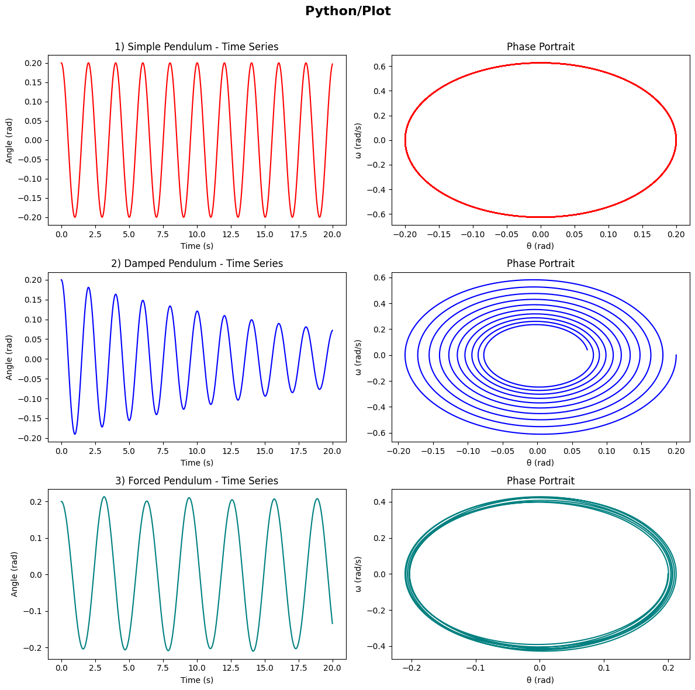

# Problem 2
# Investigating the Dynamics of a Forced Damped Pendulum

## Motivation

The forced damped pendulum is an ideal system to study how damping, restoring forces, and external periodic forces interact. This system exhibits a rich variety of behaviors such as resonance, chaos, and periodic motion. These phenomena have widespread applications in fields like energy harvesting, mechanical structures under stress, and oscillating systems. By analyzing how external forces and damping affect the motion, we can gain insights into real-world systems like suspension bridges and oscillating circuits.

## 1. Theoretical Foundation

# Pendulum Motion and Interference

## System of Equations

The motion of a pendulum can be described by the following second-order differential equation:

$$
\frac{d^2\theta}{dt^2} + b \frac{d\theta}{dt} + \frac{g}{L} \sin(\theta) = A \cos(\omega t)
$$

Where:
- \( \theta(t) \) is the angle of the pendulum at time \( t \),
- \( b \) is the damping coefficient,
- \( g \) is the gravitational acceleration,
- \( L \) is the length of the pendulum,
- \( A \) is the amplitude of the external force,
- \( \omega \) is the angular frequency of the external force.

### Scenarios

For different scenarios, the differential equation changes as follows:

#### 1. **Pure Pendulum (No damping, No external force)**

For the pure pendulum, there is no damping (\( b = 0 \)) and no external force (\( A = 0 \)). The equation becomes:

$$
\frac{d^2\theta}{dt^2} + \frac{g}{L} \sin(\theta) = 0
$$

This represents the standard equation for an undamped pendulum, where the motion is purely due to gravity.

#### 2. **Pendulum with Damping (Damping, No external force)**

For a pendulum with damping, the damping term (\( b \)) is non-zero, but there is still no external force (\( A = 0 \)). The equation becomes:

$$
\frac{d^2\theta}{dt^2} + b \frac{d\theta}{dt} + \frac{g}{L} \sin(\theta) = 0
$$

In this case, the damping term \( b \) causes the amplitude of oscillations to decrease over time, eventually leading to the pendulum coming to rest.

#### 3. **Pendulum with External Force (No damping, External force)**

When there is an external force applied to the pendulum, the damping coefficient \( b \) is set to zero, and an external force \( A \cos(\omega t) \) is applied. The equation becomes:

$$
\frac{d^2\theta}{dt^2} + \frac{g}{L} \sin(\theta) = A \cos(\omega t)
$$

In this case, the external force can drive the pendulum to oscillate with a constant amplitude, depending on the frequency \( \omega \) of the force and the natural frequency of the pendulum.

#### 4. **Forced Damped Pendulum (Both damping and external force)**

In the forced damped pendulum scenario, both the damping term \( b \) and the external force \( A \cos(\omega t) \) are present. The equation becomes:

$$
\frac{d^2\theta}{dt^2} + b \frac{d\theta}{dt} + \frac{g}{L} \sin(\theta) = A \cos(\omega t)
$$

This combined system leads to a more complex behavior, where the damping and external force interact, potentially leading to resonant oscillations or chaotic behavior under certain conditions.

### Equations Summary

For a general forced damped pendulum system:

$$
\frac{d^2\theta}{dt^2} + b \frac{d\theta}{dt} + \frac{g}{L} \sin(\theta) = A \cos(\omega t)
$$

Where:
- \( \theta(t) \) is the angular displacement at time \( t \),
- \( b \) is the damping coefficient,
- \( g \) is the gravitational acceleration,
- \( L \) is the length of the pendulum,
- \( A \) is the amplitude of the external force,
- \( \omega \) is the frequency of the external force.

## Explanation of Motion

### 1. **Pure Pendulum**:
For the pure pendulum case, the motion is driven solely by gravity. The angle \( \theta(t) \) oscillates in a simple harmonic manner, with the period depending on the length of the pendulum \( L \) and the gravitational acceleration \( g \). The equation for the pure pendulum is:

$$
\frac{d^2\theta}{dt^2} + \frac{g}{L} \sin(\theta) = 0
$$

### 2. **Pendulum with Damping**:
When damping is introduced, the oscillations are gradually reduced over time due to the energy lost in each cycle. The equation becomes:

$$
\frac{d^2\theta}{dt^2} + b \frac{d\theta}{dt} + \frac{g}{L} \sin(\theta) = 0
$$

The damping term \( b \) causes the pendulum to lose energy, and the oscillations eventually decay.

### 3. **Pendulum with External Force**:
Introducing an external force to the system allows the pendulum to oscillate with a constant amplitude, depending on the external frequency \( \omega \). The equation becomes:

$$
\frac{d^2\theta}{dt^2} + \frac{g}{L} \sin(\theta) = A \cos(\omega t)
$$

This can lead to resonant behavior if the frequency \( \omega \) of the external force matches the natural frequency of the pendulum.

### 4. **Forced Damped Pendulum**:
For the forced damped pendulum, the equation includes both damping and external forcing, leading to more complex behavior:

$$
\frac{d^2\theta}{dt^2} + b \frac{d\theta}{dt} + \frac{g}{L} \sin(\theta) = A \cos(\omega t)
$$

The interaction between damping and external forcing can lead to chaotic behavior if the driving force frequency is close to the system's natural frequency (resonance), or the system may oscillate with large amplitudes under certain conditions.

### Influence of Damping, Driving Amplitude, and Frequency

- **Damping Coefficient (\( \gamma \))**: As \( \gamma \) increases, the amplitude of oscillations decreases, and the system may move to a critically damped or overdamped state.
- **Driving Amplitude (\( F_0 \))**: Increasing the driving amplitude increases the oscillation amplitude, especially near resonance.
- **Driving Frequency (\( \omega \))**: The frequency of the external force affects the system’s oscillations. Resonance occurs when \( \omega \) is close to \( \omega_0 \), causing large oscillations.

### 4.1 Effect of Parameters
- **Damping (\( \gamma \))**: Higher damping suppresses oscillations.
- **Driving Amplitude (\( A \))**: Large \( A \) can lead to chaotic behavior.
- **Driving Frequency (\( \omega \))**: When \( \omega \approx \omega_0 \), resonance occurs, leading to large oscillations.

### 4.2 Transition to Chaos
By varying \( A \) and \( \omega \), the pendulum can exhibit periodic, quasiperiodic, or chaotic motion.Phase space plots and Poincaré sections illustrate these behaviors.

 
## 5. Practical Applications
- **Energy Harvesting**: Utilizing resonance for efficient energy transfer.
- **Suspension Bridges**: Preventing dangerous oscillations.
- **Electrical Circuits**: Analogous behavior in driven RLC circuits.

## 6. Conclusion
The forced damped pendulum is a rich system for studying nonlinear dynamics. Through numerical simulations, we can observe diverse behaviors, from simple oscillations to chaos, providing insight into both fundamental physics and engineering applications.

