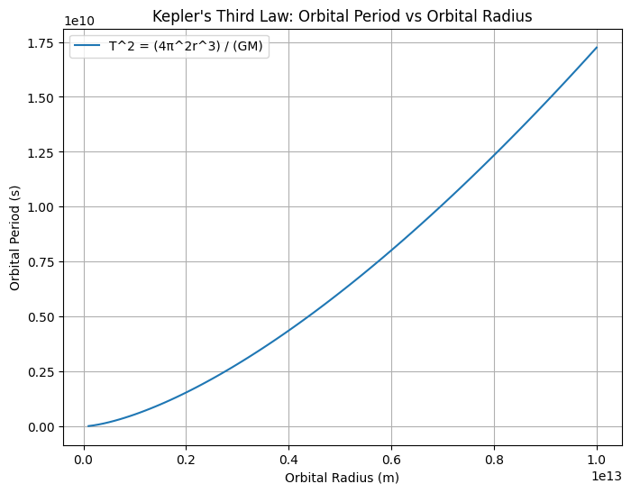

# Problem 1
# Orbital Period and Orbital Radius

## Motivation

Kepler's Third Law, which relates the square of the orbital period to the cube of the orbital radius, is a cornerstone of celestial mechanics. This relationship provides insight into the motion of celestial bodies and the nature of gravitational interactions. It is used to predict planetary movements, the behavior of satellites, and even the distances to distant stars. By analyzing this law, we can connect fundamental principles of gravity with real-world phenomena like planetary orbits and satellite systems.

## 1. Derivation of the Relationship

### Gravitational Force and Circular Motion

The gravitational force provides the necessary centripetal force for a planet to maintain a circular orbit around the Sun. The gravitational force \( F \) between two objects is given by Newton's Law of Gravitation:

$$
F = \frac{G M m}{r^2}
$$

Where:
- \( G \) is the gravitational constant,
- \( M \) is the mass of the central body (e.g., the Sun),
- \( m \) is the mass of the orbiting object (e.g., a planet),
- \( r \) is the distance between the two objects.

For a circular orbit, the centripetal force is:

$$
F = \frac{m v^2}{r}
$$

Where \( v \) is the orbital velocity of the planet. Equating the gravitational force and the centripetal force:

$$
\frac{G M m}{r^2} = \frac{m v^2}{r}
$$

Simplifying, we get:

$$
v^2 = \frac{G M}{r}
$$

### Orbital Period

The orbital velocity \( v \) is related to the orbital period \( T \) by the circumference of the orbit \( 2 \pi r \):

$$
v = \frac{2 \pi r}{T}
$$

Substituting this into the previous equation:

$$
\left( \frac{2 \pi r}{T} \right)^2 = \frac{G M}{r}
$$

Simplifying further:

$$
\frac{4 \pi^2 r^2}{T^2} = \frac{G M}{r}
$$

Rearranging, we obtain Kepler’s Third Law:

$$
T^2 = \frac{4 \pi^2 r^3}{G M}
$$

This shows that the square of the orbital period \( T \) is directly proportional to the cube of the orbital radius \( r \), with a constant of proportionality involving the mass of the central body \( M \).

## 2. Implications for Astronomy

### Planetary Masses and Distances

Kepler’s Third Law can be used to calculate the masses of celestial bodies (such as planets and stars) if the orbital period and radius are known. For example, by observing the Moon's orbit around Earth, we can estimate the mass of the Earth, or using the orbital parameters of planets, we can determine the mass of the Sun.

### Satellite Orbits

For artificial satellites orbiting Earth, the relationship allows for the determination of the orbital period for a given orbital radius. This is crucial for understanding satellite motion and predicting satellite trajectories.

### Practical Use in Space Exploration

This law is instrumental for mission planning and navigation in space, such as calculating the timing for satellite launches or space probes.

## 3. Real-World Examples

### The Moon's Orbit around Earth

The Moon’s orbit around Earth provides an example of Kepler’s Third Law in action. By knowing the radius of the Moon’s orbit and the period, we can apply Kepler’s Third Law to calculate the mass of Earth, which is consistent with known values.

### Planetary Orbits in the Solar System

In the Solar System, planets follow nearly circular orbits around the Sun. By measuring the orbital period and radius of a planet, Kepler's Third Law can be used to derive the mass of the Sun. This relationship also helps us understand the spacing of the planets and how they interact gravitationally.

## 4. Computational Model

### Simulating Circular Orbits

Below is a Python script that simulates the motion of a planet in a circular orbit, visualizing the relationship between the orbital period and radius.

```python
import numpy as np
import matplotlib.pyplot as plt

# Constants
G = 6.67430e-11  # Gravitational constant (m^3 kg^-1 s^-2)
M = 1.989e30  # Mass of the Sun (kg)
r_values = np.linspace(1e11, 1e13, 100)  # Range of orbital radii (in meters)

# Calculate orbital period using Kepler's Third Law
T_values = 2 * np.pi * np.sqrt(r_values**3 / (G * M))

# Plot the relationship between orbital period and orbital radius
plt.figure(figsize=(8, 6))
plt.plot(r_values, T_values, label="T^2 = (4π^2r^3) / (GM)")
plt.xlabel('Orbital Radius (m)')
plt.ylabel('Orbital Period (s)')
plt.title('Kepler\'s Third Law: Orbital Period vs Orbital Radius')
plt.grid(True)
plt.legend()
plt.show()
```
