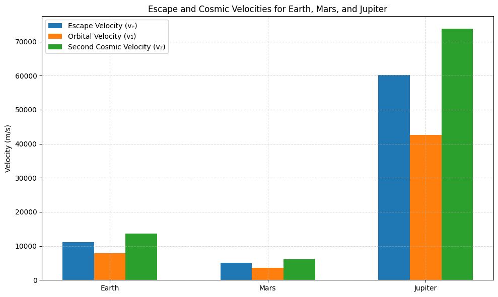

# Problem 2
# Escape Velocities and Cosmic Velocities

## 1. Motivation

The concept of escape velocity is central to understanding the conditions necessary to escape the gravitational influence of a celestial body. Building on this, the first, second, and third cosmic velocities define the thresholds for orbital motion, escape from a celestial body's gravity, and departure from a star system. These principles play a key role in modern space exploration, from launching satellites into orbit to planning interplanetary missions and even potential interstellar travel.

## 2. Mathematical Derivations and Parameters


##  First Cosmic Velocity (Orbital Velocity)

The first cosmic velocity is the minimum velocity an object must have to maintain a stable circular orbit around a celestial body without propulsion. It is derived from the balance between the gravitational force and the centripetal force that keeps an object in orbit

### Derivation:

Equating gravitational force to centripetal force:

$$
\frac{mv^2}{r} = \frac{GMm}{r^2}
$$

Cancel \( m \) and solve for \( v \):

$$
v = \sqrt{\frac{GM}{r}}
$$

✅ This is the **first cosmic velocity** (orbital velocity).

---

##  Second Cosmic Velocity (Escape Velocity)

The second cosmic velocity is the minimum velocity required for an object to escape the gravitational pull of a celestial body. It is derived from the energy conservation principle, where the object's kinetic energy must be at least equal to the gravitational potential energy.

### Derivation:

Total mechanical energy at escape = 0:

$$
\frac{1}{2}mv^2 - \frac{GMm}{r} = 0
$$

Solve for \( v \):

$$
v = \sqrt{\frac{2GM}{r}}
$$

✅ This is the **second cosmic velocity** (escape velocity).

---

## Third Cosmic Velocity (Solar Escape Velocity)

The third cosmic velocity is the velocity required to escape the gravitational influence of the entire solar system. This velocity is much greater than the second cosmic velocity, as it accounts for the mass of the Sun and the distance from the celestial body to the Sun

### Derivation:

Using Sun's mass and Earth's orbital radius:

$$
v = \sqrt{\frac{2GM_{\odot}}{r_{\text{orbit}}}}
$$

Where:
- M = Mass of the Sun
- r = Radius of Earth's orbit around the Sun

✅ This is the **third cosmic velocity**.

### Parameters Affecting Cosmic Velocities

1. **Mass of the Celestial Body**: Larger masses increase the gravitational pull, leading to higher velocities.
2. **Distance from the Center of the Body**: The closer an object is to the center, the higher the required velocity for orbiting or escaping.
3. **Gravitational Constant**: The universal gravitational constant \(G\) is a fixed value but plays a key role in these calculations.

By analyzing these velocities, we can compare the conditions required for satellites to stay in orbit, escape Earth's gravity, and escape other planets velocities.

Using standard values:
- Gravitational constant: $G = 6.674 \times 10^{-11} \ m^3 kg^{-1} s^{-2}$
- Earth: $M_E = 5.972 \times 10^{24} \ kg$, $R_E = 6371 \times 10^3 \ m$
- Mars: $M_M = 6.417 \times 10^{23} \ kg$, $R_M = 3389 \times 10^3 \ m$
- Jupiter: $M_J = 1.898 \times 10^{27} \ kg$, $R_J = 69911 \times 10^3 \ m$

We compute:

$$v_{1E} = \sqrt{\frac{GM_E}{R_E}}$$

$$v_{2E} = \sqrt{2}v_{1E}$$

$$v_{3E} = \sqrt{v_{2E}^2 + v_{orbE}^2}$$

## 3. Calculation and Visualization

Below is a Python script that calculates and visualizes the first, second, and third cosmic velocities for Earth, Mars, and Jupiter.

## 🧾 Explanation
This script calculates and visualizes three important velocities for space travel:

Escape Velocity (vₑ): The minimum speed needed to completely break free from a planet’s gravity.

First Cosmic Velocity (v₁): The speed required to orbit the planet in a low circular orbit — what satellites need.

Second Cosmic Velocity (v₂): The speed to escape the planet on a parabolic path — e.g., interplanetary missions.

## The program:

Uses the physical formulas for each velocity based on the mass and radius of Earth, Mars, and Jupiter.

Calculates these values for each planet.

Plots the results in a grouped bar chart so you can compare how gravity influences spaceflight requirements on different planets.

## 🚀 Insight
From the graph, you'll see that:

Jupiter requires far greater speeds for any kind of orbit or escape.

Mars has much lower requirements, making it easier to launch from.

Earth sits in the middle, and it’s our current reference for designing space missions.

```python
import numpy as np
import matplotlib.pyplot as plt

# Gravitational constant (m^3 kg^-1 s^-2)
G = 6.674 * 10**-11

# Masses (kg) and radii (m) of celestial bodies
celestial_bodies = {
    'Earth': {
        'mass': 5.972 * 10**24,
        'radius': 6371 * 10**3
    },
    'Mars': {
        'mass': 0.64171 * 10**24,
        'radius': 3389.5 * 10**3
    },
    'Jupiter': {
        'mass': 1.898 * 10**27,
        'radius': 69911 * 10**3
    }
}

# Functions to calculate velocities
def escape_velocity(M, R):
    return np.sqrt((2 * G * M) / R)

def first_cosmic_velocity(M, R):
    return np.sqrt((G * M) / R)

def second_cosmic_velocity(M, R):
    return np.sqrt((3 * G * M) / R)

# Store results
labels = []
v_escape = []
v_orbit = []
v_second = []

for body, data in celestial_bodies.items():
    M = data['mass']
    R = data['radius']
    
    labels.append(body)
    v_escape.append(escape_velocity(M, R))
    v_orbit.append(first_cosmic_velocity(M, R))
    v_second.append(second_cosmic_velocity(M, R))

# Plotting
x = np.arange(len(labels))
width = 0.2

fig, ax = plt.subplots(figsize=(10, 6))
ax.bar(x - width, v_escape, width, label='Escape Velocity (vₑ)')
ax.bar(x, v_orbit, width, label='Orbital Velocity (v₁)')
ax.bar(x + width, v_second, width, label='Second Cosmic Velocity (v₂)')

ax.set_xticks(x)
ax.set_xticklabels(labels)
ax.set_ylabel('Velocity (m/s)')
ax.set_title('Escape and Cosmic Velocities for Earth, Mars, and Jupiter')
ax.legend()
ax.grid(True, linestyle='--', alpha=0.5)

plt.tight_layout()
plt.show()

```



collab = https://colab.research.google.com/drive/1OUCKy3RlZUdiVgR161noFqxtuGGNpAVe?usp=sharing

# Importance in Space Exploration

## 4.1 Launching Satellites
The first cosmic velocity is critical for launching satellites into stable orbits. Understanding this velocity allows engineers to determine the minimum speed needed for a satellite to maintain orbit without falling back to Earth.

## 4.2 Missions to Other Planets
Escape velocities are crucial for missions to other planets. A spacecraft must achieve the escape velocity of Earth to leave its gravitational field and travel to another planet. Similarly, the velocities for entering orbit around other planets depend on their first cosmic velocities.

## 4.3 Interstellar Travel
The third cosmic velocity plays a role in conceptualizing missions beyond the Solar System. While interstellar travel is not currently feasible, understanding the third cosmic velocity helps in theoretical discussions about reaching other star systems.

# Conclusion
The study of escape velocities and cosmic velocities is fundamental to space exploration. These velocities define the energy thresholds for various space missions, including satellite launches, interplanetary travel, and potential interstellar journeys.