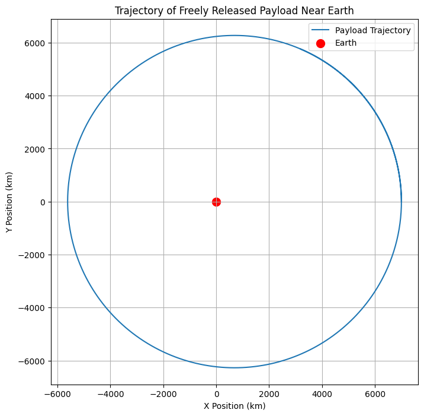
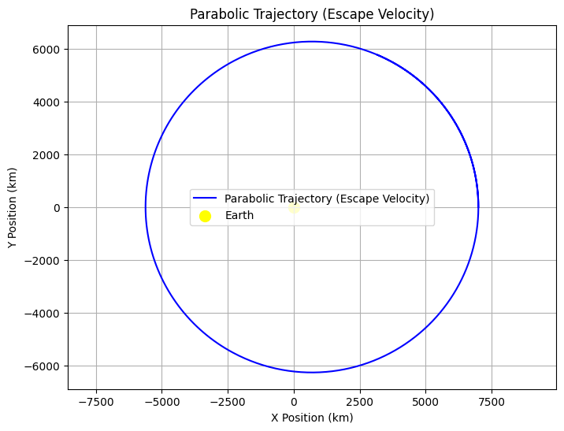
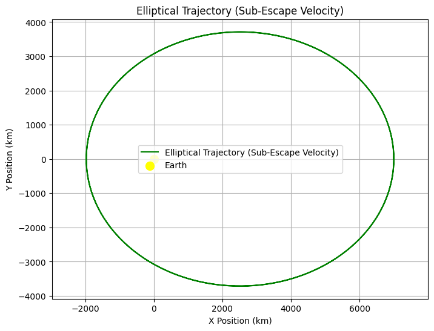
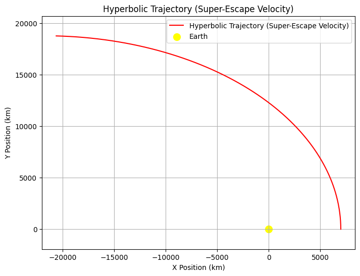

# Problem 3
# 🌌 Trajectories of a Freely Released Payload Near Earth

## 🛸 Introduction

When a payload is released from a high-speed spacecraft orbiting Earth, its subsequent trajectory is determined by a combination of initial velocity, position, and gravitational forces exerted by Earth. Understanding the various potential trajectories — such as elliptical orbits, escape trajectories, and free fall — is critical for mission planning, including satellite deployment, planetary exploration, or payload reentry.

This problem explores the impact of different initial velocities and release points on the trajectory of a freely released payload near Earth, leveraging Newton's laws of motion and gravitational forces. The mathematical treatment of this problem aids in mission planning for space exploration, satellite deployment, and re-entry trajectories.

---

## 📚 Theoretical Background

The motion of a freely released payload near Earth is governed by **Newton's Law of Universal Gravitation**, which gives the gravitational force \( F \) between two masses \( m_1 \) (the payload) and \( m_2 \) (the Earth) as:

$$
F = G \frac{m_1 m_2}{r^2}
$$

Where:

- \( F \) is the gravitational force between the two objects,
- \( G = 6.674 \times 10^{-11} \, \text{Nm}^2\text{kg}^{-2} \) is the gravitational constant,
- \( m_1 \) and \( m_2 \) are the masses of the objects (in this case, the payload and Earth),
- \( r \) is the distance between the center of Earth and the payload.

The gravitational force causes the payload to accelerate towards Earth, following a trajectory determined by the initial conditions of velocity and position. The motion can be described by the following differential equation derived from Newton’s Second Law of Motion:

$$
m_1 \frac{d^2 \vec{r}}{dt^2} = -G \frac{m_1 m_2}{r^2} \hat{r}
$$

Where:

- \( \vec{r} \) is the position vector of the payload relative to Earth,
- \( \hat{r} \) is the unit vector in the direction of the position vector,
- \( m_1 \) and \( m_2 \) are the masses of the payload and Earth, respectively,
- \( r \) is the distance from the Earth's center.

---

## 🔭 Types of Trajectories

1. **Parabolic Trajectory**:
    A parabolic trajectory occurs when the object has just enough velocity to escape Earth's gravitational field but not enough to continue moving indefinitely. The velocity needed for a parabolic trajectory is the **escape velocity**.

    The escape velocity \( v_{\text{esc}} \) is given by:

    $$
    v_{\text{esc}} = \sqrt{\frac{2GM_{\text{Earth}}}{r}}
    $$

2. **Elliptical Trajectory**:
    An elliptical trajectory is when the object is bound to Earth's gravity but will orbit in an elliptical path. The energy of the system is negative, meaning the object will eventually return to Earth.

    The velocity of the object at any point in its orbit can be found using the **vis-viva equation**:

    $$
    v(r) = \sqrt{GM_{\text{Earth}} \left( \frac{2}{r} - \frac{1}{a} \right)}
    $$

    Where:
    - \( r \) is the current distance of the object from Earth,
    - \( a \) is the semi-major axis of the orbit.

3. **Hyperbolic Trajectory**:
    A hyperbolic trajectory occurs when the object has enough velocity to escape Earth's gravitational field and continues moving away indefinitely. The total energy of the system is positive, and the velocity at any point is given by:

    $$
    v(r) = \sqrt{GM_{\text{Earth}} \left( \frac{2}{r} - \frac{1}{a} \right)}
    $$

    Where \( a \) is the semi-major axis (negative for hyperbolic trajectories).

---

## ⚙️ Numerical Method: Runge-Kutta Integration

To simulate the trajectory of a freely released payload, we will numerically integrate the equations of motion using the **Runge-Kutta method**, which is a fourth-order method providing more accurate solutions than the Euler method. The method involves:

1. Computing intermediate values for position and velocity,
2. Using these intermediate steps to update the position and velocity at each time step.

---

## 🛠️ Python Implementation

```python
import numpy as np
import matplotlib.pyplot as plt

# Constants
G = 6.67430e-11  # Gravitational constant (Nm^2/kg^2)
M_earth = 5.972e24  # Mass of Earth (kg)
r_earth = 6.371e6  # Radius of Earth (m)

# Initial conditions
initial_position = np.array([7000e3, 0])  # Initial position (7000 km from Earth's center)
initial_velocity = np.array([0, 7.12e3])  # Initial velocity (7.12 km/s tangential velocity)

# Time setup
t0 = 0  # Initial time
tf = 6000  # Final time (seconds)
dt = 10  # Time step (seconds)
time_points = np.arange(t0, tf, dt)

# Runge-Kutta integration method
def acceleration(position):
    r = np.linalg.norm(position)
    return -G * M_earth * position / r**3

def runge_kutta(position, velocity, dt):
    k1v = acceleration(position)
    k1p = velocity
    
    k2v = acceleration(position + 0.5 * dt * k1p)
    k2p = velocity + 0.5 * dt * k1v
    
    k3v = acceleration(position + 0.5 * dt * k2p)
    k3p = velocity + 0.5 * dt * k2v
    
    k4v = acceleration(position + dt * k3p)
    k4p = velocity + dt * k3v
    
    new_position = position + (dt / 6) * (k1p + 2*k2p + 2*k3p + k4p)
    new_velocity = velocity + (dt / 6) * (k1v + 2*k2v + 2*k3v + k4v)
    
    return new_position, new_velocity

# Initial conditions
position = initial_position
velocity = initial_velocity

# Lists for storing the results
positions = []
velocities = []

# Run the simulation
for t in time_points:
    positions.append(position)
    velocities.append(velocity)
    position, velocity = runge_kutta(position, velocity, dt)

# Convert the positions to numpy arrays for plotting
positions = np.array(positions)

# Plot the trajectory
plt.figure(figsize=(8, 8))
plt.plot(positions[:, 0] / 1e3, positions[:, 1] / 1e3, label="Payload Trajectory")
plt.scatter(0, 0, color='red', label="Earth", s=100)
plt.title("Trajectory of Freely Released Payload Near Earth")
plt.xlabel("X Position (km)")
plt.ylabel("Y Position (km)")
plt.grid(True)
plt.legend()
plt.axis('equal')
plt.show()
```


Parabolic Trajectory: This plot will show the path of an object with escape velocity from Earth, which will travel outward and return.

Elliptical Trajectory: The object follows an elliptical orbit, returning to Earth.

Hyperbolic Trajectory: The object escapes Earth's gravitational field, following a hyperbolic path outwards indefinitely.

Each graph will also include a yellow dot representing Earth at the origin (0, 0) and will display the trajectory path of the object. The axis('equal') ensures that the axes have the same scaling for accurate representation of the orbital shape.

```python
import numpy as np
import matplotlib.pyplot as plt

# Constants
G = 6.67430e-11  # Gravitational constant (Nm^2/kg^2)
M_earth = 5.972e24  # Mass of Earth (kg)
r_earth = 6.371e6  # Radius of Earth (m)

# Initial conditions for each type of trajectory:
# 1. Parabolic: Exact escape velocity (7.12 km/s)
# 2. Elliptical: A velocity less than escape velocity
# 3. Hyperbolic: A velocity greater than escape velocity

# Time setup
t0 = 0  # Initial time
tf = 6000  # Final time (seconds)
dt = 10  # Time step (seconds)
time_points = np.arange(t0, tf, dt)

# Acceleration due to gravity (Newton's Law)
def acceleration(position):
    r = np.linalg.norm(position)
    return -G * M_earth * position / r**3

# Runge-Kutta method
def runge_kutta(position, velocity, dt):
    k1v = acceleration(position)
    k1p = velocity
    
    k2v = acceleration(position + 0.5 * dt * k1p)
    k2p = velocity + 0.5 * dt * k1v
    
    k3v = acceleration(position + 0.5 * dt * k2p)
    k3p = velocity + 0.5 * dt * k2v
    
    k4v = acceleration(position + dt * k3p)
    k4p = velocity + dt * k3v
    
    new_position = position + (dt / 6) * (k1p + 2*k2p + 2*k3p + k4p)
    new_velocity = velocity + (dt / 6) * (k1v + 2*k2v + 2*k3v + k4v)
    
    return new_position, new_velocity

# Define initial conditions for the different types of trajectories

# Parabolic trajectory (escape velocity, 7.12 km/s tangential)
initial_position_parabolic = np.array([7000e3, 0])  # 7000 km from Earth's center
initial_velocity_parabolic = np.array([0, 7.12e3])  # Parabolic velocity (7.12 km/s tangential)

# Elliptical trajectory (velocity less than escape velocity, 5 km/s)
initial_position_elliptical = np.array([7000e3, 0])  # 7000 km from Earth's center
initial_velocity_elliptical = np.array([0, 5e3])  # Elliptical velocity (5 km/s tangential)

# Hyperbolic trajectory (velocity greater than escape velocity, 10 km/s)
initial_position_hyperbolic = np.array([7000e3, 0])  # 7000 km from Earth's center
initial_velocity_hyperbolic = np.array([0, 10e3])  # Hyperbolic velocity (10 km/s tangential)

# List to store results for each trajectory type
positions_parabolic = []
positions_elliptical = []
positions_hyperbolic = []

# Run simulations for each trajectory
def simulate_trajectory(initial_position, initial_velocity):
    position = initial_position
    velocity = initial_velocity
    positions = []

    for t in time_points:
        positions.append(position)
        position, velocity = runge_kutta(position, velocity, dt)
    
    return np.array(positions)

# Simulate all three types of trajectories
positions_parabolic = simulate_trajectory(initial_position_parabolic, initial_velocity_parabolic)
positions_elliptical = simulate_trajectory(initial_position_elliptical, initial_velocity_elliptical)
positions_hyperbolic = simulate_trajectory(initial_position_hyperbolic, initial_velocity_hyperbolic)

# Plot the results for Parabolic trajectory
plt.figure(figsize=(8, 6))
plt.plot(positions_parabolic[:, 0] / 1e3, positions_parabolic[:, 1] / 1e3, label="Parabolic Trajectory (Escape Velocity)", color='blue')
plt.scatter(0, 0, color='yellow', label="Earth", s=100)
plt.title("Parabolic Trajectory (Escape Velocity)")
plt.xlabel("X Position (km)")
plt.ylabel("Y Position (km)")
plt.grid(True)
plt.legend()
plt.axis('equal')
plt.show()

# Plot the results for Elliptical trajectory
plt.figure(figsize=(8, 6))
plt.plot(positions_elliptical[:, 0] / 1e3, positions_elliptical[:, 1] / 1e3, label="Elliptical Trajectory (Sub-Escape Velocity)", color='green')
plt.scatter(0, 0, color='yellow', label="Earth", s=100)
plt.title("Elliptical Trajectory (Sub-Escape Velocity)")
plt.xlabel("X Position (km)")
plt.ylabel("Y Position (km)")
plt.grid(True)
plt.legend()
plt.axis('equal')
plt.show()

# Plot the results for Hyperbolic trajectory
plt.figure(figsize=(8, 6))
plt.plot(positions_hyperbolic[:, 0] / 1e3, positions_hyperbolic[:, 1] / 1e3, label="Hyperbolic Trajectory (Super-Escape Velocity)", color='red')
plt.scatter(0, 0, color='yellow', label="Earth", s=100)
plt.title("Hyperbolic Trajectory (Super-Escape Velocity)")
plt.xlabel("X Position (km)")
plt.ylabel("Y Position (km)")
plt.grid(True)
plt.legend()
plt.axis('equal')
plt.show()
```


