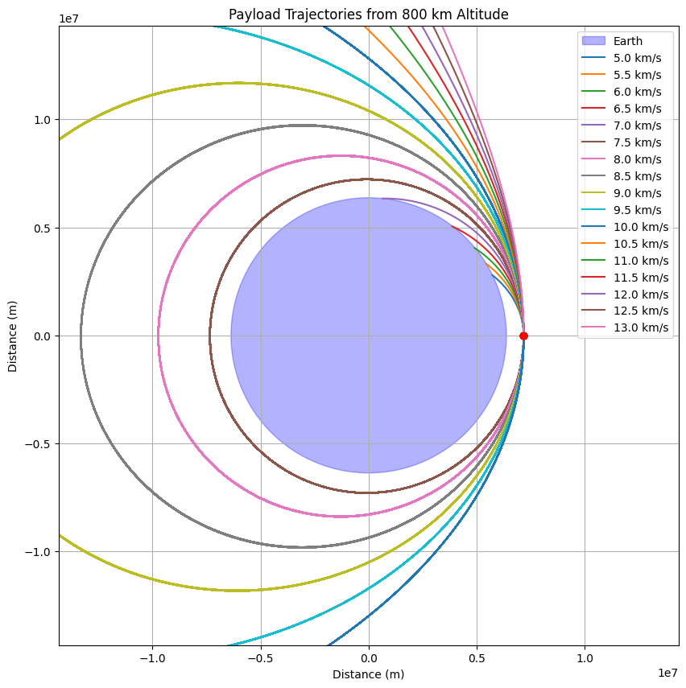

# Problem 3
# 🌌 Trajectories of a Freely Released Payload Near Earth

##  Introduction

When a payload is released from a high-speed spacecraft orbiting Earth, its subsequent trajectory is determined by a combination of initial velocity, position, and gravitational forces exerted by Earth. Understanding the various potential trajectories — such as elliptical orbits, escape trajectories, and free fall — is critical for mission planning, including satellite deployment, planetary exploration, or payload reentry.

This problem explores the impact of different initial velocities and release points on the trajectory of a freely released payload near Earth, leveraging Newton's laws of motion and gravitational forces. The mathematical treatment of this problem aids in mission planning for space exploration, satellite deployment, and re-entry trajectories.

---

##  Theoretical Background

The motion of a freely released payload near Earth is governed by **Newton's Law of Universal Gravitation**, which gives the gravitational force \( F \) between two masses \( m_1 \) (the payload) and \( m_2 \) (the Earth) as:

$$
F = G \frac{m_1 m_2}{r^2}
$$

Where:

- \( F \) is the gravitational force between the two objects,
- \( G = 6.674 \times 10^{-11} \, \text{Nm}^2\text{kg}^{-2} \) is the gravitational constant,
- \( m_1 \) and \( m_2 \) are the masses of the objects (in this case, the payload and Earth),
- \( r \) is the distance between the center of Earth and the payload.

The gravitational force causes the payload to accelerate towards Earth, following a trajectory determined by the initial conditions of velocity and position. The motion can be described by the following differential equation derived from Newton’s Second Law of Motion:

$$
m_1 \frac{d^2 \vec{r}}{dt^2} = -G \frac{m_1 m_2}{r^2} \hat{r}
$$

Where:

- \( \vec{r} \) is the position vector of the payload relative to Earth,
- \( \hat{r} \) is the unit vector in the direction of the position vector,
- \( m_1 \) and \( m_2 \) are the masses of the payload and Earth, respectively,
- \( r \) is the distance from the Earth's center.

---

##  Types of Trajectories

1. **Parabolic Trajectory**:
    A parabolic trajectory occurs when the object has just enough velocity to escape Earth's gravitational field but not enough to continue moving indefinitely. The velocity needed for a parabolic trajectory is the **escape velocity**.

    The escape velocity \( v_{\text{esc}} \) is given by:

    $$
    v_{\text{esc}} = \sqrt{\frac{2GM_{\text{Earth}}}{r}}
    $$

2. **Elliptical Trajectory**:
    An elliptical trajectory is when the object is bound to Earth's gravity but will orbit in an elliptical path. The energy of the system is negative, meaning the object will eventually return to Earth.

    The velocity of the object at any point in its orbit can be found using the **vis-viva equation**:

    $$
    v(r) = \sqrt{GM_{\text{Earth}} \left( \frac{2}{r} - \frac{1}{a} \right)}
    $$

    Where:
    - \( r \) is the current distance of the object from Earth,
    - \( a \) is the semi-major axis of the orbit.

3. **Hyperbolic Trajectory**:
    A hyperbolic trajectory occurs when the object has enough velocity to escape Earth's gravitational field and continues moving away indefinitely. The total energy of the system is positive, and the velocity at any point is given by:

    $$
    v(r) = \sqrt{GM_{\text{Earth}} \left( \frac{2}{r} - \frac{1}{a} \right)}
    $$

    Where \( a \) is the semi-major axis (negative for hyperbolic trajectories).

---

##  Numerical Method: Runge-Kutta Integration

To simulate the trajectory of a freely released payload, we will numerically integrate the equations of motion using the **Runge-Kutta method**, which is a fourth-order method providing more accurate solutions than the Euler method. The method involves:

1. Computing intermediate values for position and velocity,
2. Using these intermediate steps to update the position and velocity at each time step.

---

##  Python Implementation

```python
import numpy as np
import matplotlib.pyplot as plt
from matplotlib.patches import Circle

# Constants
G = 6.67430e-11  # Gravitational constant (m^3 kg^-1 s^-2)
M_earth = 5.972e24  # Mass of Earth (kg)
R_earth = 6371e3  # Earth radius (m)
h = 800e3  # Initial altitude (m)
initial_r = R_earth + h  # Initial distance from Earth's center

# Initial conditions
initial_velocities = np.arange(5, 13.5, 0.5) * 1000  # Convert km/s to m/s
theta = np.linspace(0, 2*np.pi, 100)

# Set up plot
fig, ax = plt.subplots(figsize=(10, 10))
ax.set_aspect('equal')
ax.set_xlim(-2*initial_r, 2*initial_r)
ax.set_ylim(-2*initial_r, 2*initial_r)
ax.set_xlabel('Distance (m)')
ax.set_ylabel('Distance (m)')
ax.set_title('Payload Trajectories from 800 km Altitude')

# Draw Earth
earth = Circle((0, 0), R_earth, color='blue', alpha=0.3, label='Earth')
ax.add_patch(earth)

# Initial position (right side of Earth)
initial_pos = (initial_r, 0)

# Function to calculate trajectory
def calculate_trajectory(v0, max_steps=100000, dt=10):
    x, y = [initial_r], [0]
    vx, vy = 0, v0  # Initial velocity is purely tangential
    
    for _ in range(max_steps):
        r = np.sqrt(x[-1]**2 + y[-1]**2)
        if r < R_earth:
            break  # Stop if hits Earth
        
        # Gravitational acceleration
        a = -G * M_earth / r**2
        ax = a * x[-1]/r
        ay = a * y[-1]/r
        
        # Update velocity and position
        vx += ax * dt
        vy += ay * dt
        x.append(x[-1] + vx * dt)
        y.append(y[-1] + vy * dt)
        
    return x, y

# Plot trajectories for different velocities
for v0 in initial_velocities:
    x, y = calculate_trajectory(v0)
    label = f'{v0/1000:.1f} km/s'
    ax.plot(x, y, label=label)
    ax.plot(initial_r, 0, 'ro')  # Initial position

ax.legend()
plt.grid()
plt.show()
```
