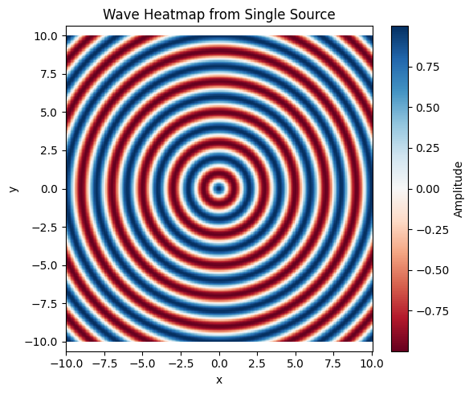
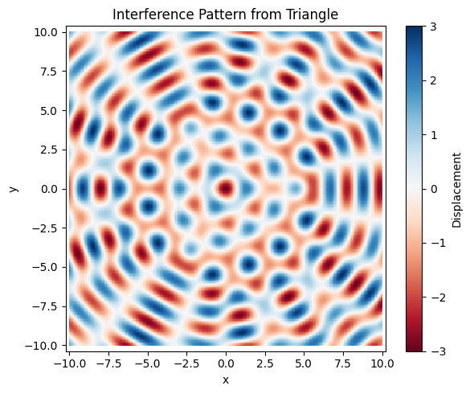
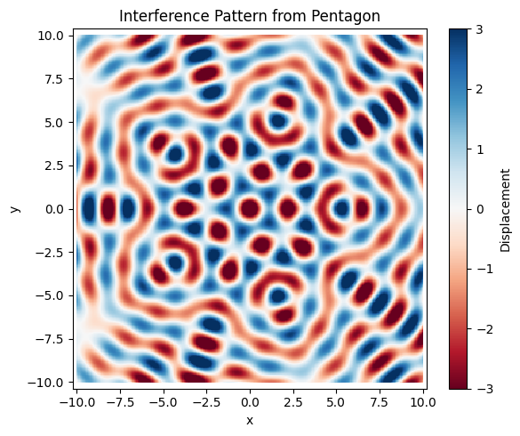

# Problem 1

# Interference Patterns on a Water Surface

## Motivation

Interference occurs when two or more waves overlap in space, producing a resultant wave of greater, lower, or the same amplitude. This phenomenon is most evident on the surface of water, where ripples from different sources meet and form distinctive patterns.

Studying these patterns helps us understand the **principle of superposition**, where the net displacement is the sum of the displacements of individual waves. Through visual simulations, we can explore **constructive interference** (waves reinforce) and **destructive interference** (waves cancel). This project provides a hands-on approach to investigating wave physics in an intuitive and engaging way.

---

## Theoretical Background

### Wave Equation for a Point Source

A circular wave emanating from a point source located at position $(x_0, y_0)$ on the surface of the water is described by:

$$
u(x, y, t) = A \cos\left(k r - \omega t + \phi\right)
$$

Where:

- $u(x, y, t)$ is the displacement of the water surface at point $(x, y)$ and time $t$
- $A$ is the amplitude of the wave
- $r = \sqrt{(x - x_0)^2 + (y - y_0)^2}$ is the distance from the point source to $(x, y)$
- $k = \frac{2\pi}{\lambda}$ is the wave number
- $\omega = 2\pi f$ is the angular frequency
- $\lambda$ is the wavelength
- $f$ is the frequency
- $\phi$ is the initial phase (assumed zero in this project)

---

## Problem Statement

To explore interference patterns, we place multiple point sources at the vertices of regular polygons on a water surface. Each source emits a circular wave with identical amplitude, wavelength, and frequency. The goal is to:

- **Simulate** the superposition of these waves
- **Visualize** interference patterns
- **Analyze** regions of constructive and destructive interference

---

## Superposition of Waves

If we have $N$ sources located at $(x_i, y_i)$, the total displacement at any point $(x, y)$ on the water surface at time $t$ is given by:

$$
u_{\text{total}}(x, y, t) = \sum_{i=1}^{N} A \cos\left(k r_i - \omega t\right)
$$

Where:

$$
r_i = \sqrt{(x - x_i)^2 + (y - y_i)^2}
$$

This equation is used to compute the total wave field through **numerical simulation**.

---

## Simulation Setup

- All sources emit **coherent waves** (constant phase difference)
- Identical parameters:
  - Amplitude $A = 1.0$
  - Wavelength $\lambda = 2.0$
  - Frequency $f = 1.0$
- Simulations are conducted on a 2D grid using **NumPy** and **Matplotlib**

---

## Configurations Studied

1. **Single Source**: Circular wavefronts expanding outward
2. **Two Sources**: Classic interference pattern with alternating bands of constructive and destructive interference
3. **Triangle Configuration**: Three sources placed at the vertices of an equilateral triangle
4. **Pentagon Configuration**: Five sources at the vertices of a regular pentagon

---

## Visualizations

- **2D Heatmaps**: Show displacement using color intensity
- **3D Surface Plots** *(optional)*: Visualize wave elevation
- **Animated GIFs** *(optional)*: Show time evolution of wave field

These visualizations help highlight the geometry of wave interference, particularly in symmetrical source configurations.

---

## Conclusion

The simulation clearly demonstrates the wave interference phenomena:

- **Constructive Interference** occurs where wave crests align
- **Destructive Interference** occurs where crests meet troughs

By changing the number and placement of wave sources, we can visualize complex interference structures that emerge purely from simple principles. This reinforces the elegance and power of wave physics.

---


```python

import numpy as np
import matplotlib.pyplot as plt
from mpl_toolkits.mplot3d import Axes3D

# Wave parameters
A = 1.0                     # Amplitude
wavelength = 2.0
k = 2 * np.pi / wavelength  # Wave number
f = 1.0
omega = 2 * np.pi * f       # Angular frequency
t = 0                       # Time snapshot

# Grid setup
x = np.linspace(-10, 10, 300)
y = np.linspace(-10, 10, 300)
X, Y = np.meshgrid(x, y)

# Distance from single source at origin
R = np.sqrt(X**2 + Y**2)
U = A * np.cos(k * R - omega * t)

# 2D Heatmap
plt.figure(figsize=(6, 5))
plt.pcolormesh(X, Y, U, cmap='RdBu', shading='auto')
plt.colorbar(label='Amplitude')
plt.title('Wave Heatmap from Single Source')
plt.xlabel('x')
plt.ylabel('y')
plt.axis('equal')
plt.tight_layout()
plt.show()

plt.show()
```




```python

import numpy as np
import matplotlib.pyplot as plt

# Wave and grid parameters
A = 1.0                     # Amplitude
wavelength = 2.0
k = 2 * np.pi / wavelength  # Wave number
f = 1.0
omega = 2 * np.pi * f       # Angular frequency
t = 0                       # Time snapshot

# Define grid
x = np.linspace(-10, 10, 300)
y = np.linspace(-10, 10, 300)
X, Y = np.meshgrid(x, y)

# Function to generate source positions for regular polygons
def generate_sources(N, radius=5.0):
    angles = np.linspace(0, 2*np.pi, N, endpoint=False)
    return np.array([[radius * np.cos(a), radius * np.sin(a)] for a in angles])

# Superposition of waves from multiple sources
def compute_wave(X, Y, sources):
    U = np.zeros_like(X)
    for sx, sy in sources:
        R = np.sqrt((X - sx)**2 + (Y - sy)**2)
        U += A * np.cos(k * R - omega * t)
    return U

# Plotting helper
def plot_wave(U, title):
    plt.figure(figsize=(6, 5))
    plt.pcolormesh(X, Y, U, shading='auto', cmap='RdBu', vmin=-3, vmax=3)
    plt.colorbar(label='Displacement')
    plt.title(title)
    plt.xlabel('x')
    plt.ylabel('y')
    plt.axis('equal')
    plt.tight_layout()
    plt.show()

# 1. Two sources (placed symmetrically on x-axis)
sources_two = np.array([[-3, 0], [3, 0]])
U_two = compute_wave(X, Y, sources_two)
plot_wave(U_two, 'Interference Pattern from Two Sources')

# 2. Triangle (3-point regular polygon)
sources_triangle = generate_sources(3)
U_triangle = compute_wave(X, Y, sources_triangle)
plot_wave(U_triangle, 'Interference Pattern from Triangle')

# 3. Pentagon (5-point regular polygon)
sources_pentagon = generate_sources(5)
U_pentagon = compute_wave(X, Y, sources_pentagon)
plot_wave(U_pentagon, 'Interference Pattern from Pentagon')


```


