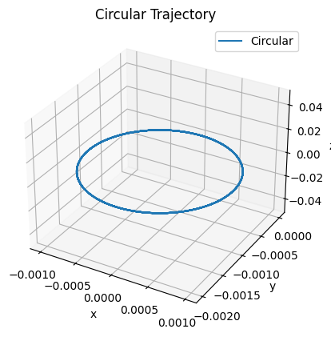
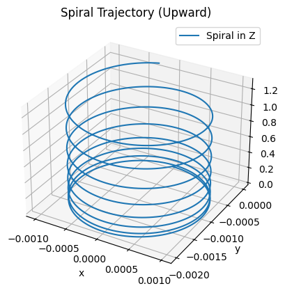
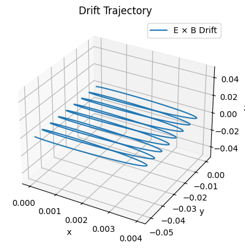

# Problem 1

# **Simulating the Effects of the Lorentz Force on Charged Particles**

## **Motivation**

The Lorentz force, defined as:

$$
\mathbf{F} = q(\mathbf{E} + \mathbf{v} \times \mathbf{B})
$$

governs the motion of charged particles in electric (\(\mathbf{E}\)) and magnetic (\(\mathbf{B}\)) fields. This fundamental force is crucial in numerous scientific and engineering applications such as plasma physics, particle accelerators, and astrophysics. Understanding and simulating the behavior of particles under the influence of the Lorentz force allows for a deeper insight into the design of practical systems such as cyclotrons, mass spectrometers, and plasma confinement devices.

In this report, we explore the motion of a charged particle in various electromagnetic field configurations using numerical simulations. By visualizing the effects of the Lorentz force, we aim to enhance our understanding of the complex trajectories that arise due to this force.

## **1. Exploration of Applications**

### **1.1 Systems Where the Lorentz Force Plays a Key Role**

- **Particle Accelerators:** In devices like cyclotrons and synchrotrons, magnetic fields are used to bend and focus particle beams. The Lorentz force helps in steering charged particles in circular or spiral paths.
- **Mass Spectrometers:** The Lorentz force separates ions based on their mass-to-charge ratio by applying a magnetic field perpendicular to their velocity, causing them to follow circular or helical trajectories.
- **Plasma Confinement:** In fusion reactors (e.g., tokamaks), magnetic fields are used to control the motion of charged particles in plasma, preventing them from escaping and facilitating controlled fusion reactions.

### **1.2 Relevance of Electric and Magnetic Fields**

- **Electric Fields (\(\mathbf{E}\))**: The electric field exerts a force on charged particles directly along the direction of the field, either attracting or repelling the particles depending on their charge.
- **Magnetic Fields (\(\mathbf{B}\))**: The magnetic field affects the motion of charged particles by producing a force perpendicular to both the velocity of the particle and the magnetic field. This results in circular or helical motion depending on the configuration of the fields.

## **2. Simulating Particle Motion**

### **2.1 Basic Simulation Setup**

We simulate the motion of a charged particle under the influence of a **uniform magnetic field**. The Lorentz force in this case can be simplified to:

$$
\mathbf{F} = q (\mathbf{v} \times \mathbf{B})
$$

We use the **Euler method** to numerically integrate the equations of motion and update the particle's velocity and position at each time step.

### **2.2 Numerical Integration**

To solve the equations of motion, we update the velocity and position using the Euler method:

$$
\mathbf{v}_{t+1} = \mathbf{v}_t + \frac{\mathbf{F}}{m} \Delta t
$$

$$
\mathbf{r}_{t+1} = \mathbf{r}_t + \mathbf{v}_{t+1} \Delta t
$$

Where:
- \(\mathbf{v}_t\) is the velocity at time step \(t\),
- \(\mathbf{r}_t\) is the position at time step \(t\),
- \(\mathbf{F}\) is the Lorentz force,
- \(m\) is the mass of the particle,
- \(q\) is the charge of the particle,
- \(\Delta t\) is the time step.

### 2.3 Simulation 

