# Problem 1
# Central Limit Theorem (CLT) Exploration through Simulations

## Introduction

The Central Limit Theorem (CLT) is one of the most fundamental concepts in statistics. It states that, regardless of the population's distribution, the sampling distribution of the sample mean will tend to be approximately normally distributed if the sample size is sufficiently large. This holds true for any underlying population distribution with finite variance.

The key takeaway is that the **distribution of the sample mean becomes approximately normal** as the sample size increases, even if the population itself is not normal. The CLT is crucial in statistical inference, where it justifies the use of the normal distribution for hypothesis testing and confidence intervals, among other applications.

## Motivation

Simulations provide an excellent way to visualize and understand how the Central Limit Theorem works in practice. By drawing random samples from various population distributions and calculating the sample means, we can observe how these sample means form a normal distribution as the sample size increases.

In this task, we explore how the sample means converge to normality by using three different population distributions:
1. **Uniform Distribution**: All outcomes are equally likely.
2. **Exponential Distribution**: Values are drawn from a distribution with a constant hazard rate.
3. **Binomial Distribution**: A distribution describing the number of successes in a fixed number of Bernoulli trials.

We will generate a large dataset for each distribution and then sample random subsets of varying sizes to calculate the sample means.

## Methodology

### Steps:
1. **Simulating Population Distributions**: We generate large datasets for each of the three population distributions: uniform, exponential, and binomial.
2. **Sampling and Calculating Sample Means**: For each population, we randomly sample data for different sample sizes (5, 10, 30, and 50) and calculate the mean of each sample.
3. **Visualization**: We plot histograms of the sample means for each sample size and observe how they approach a normal distribution as the sample size increases.

### Parameters:
- **Population size**: 100,000 (for each distribution).
- **Sample sizes**: 5, 10, 30, 50.
- **Number of simulations**: 1,000 samples for each sample size.

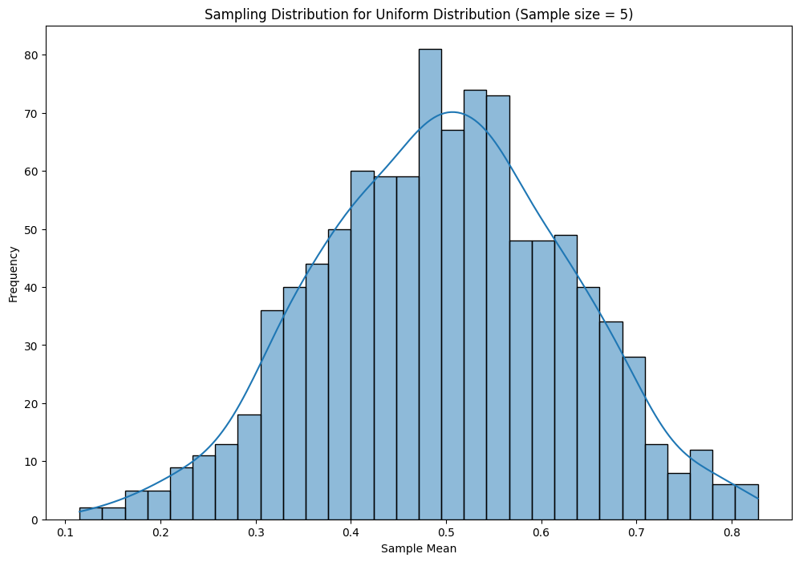

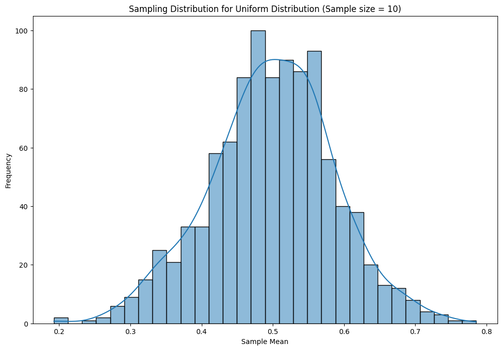

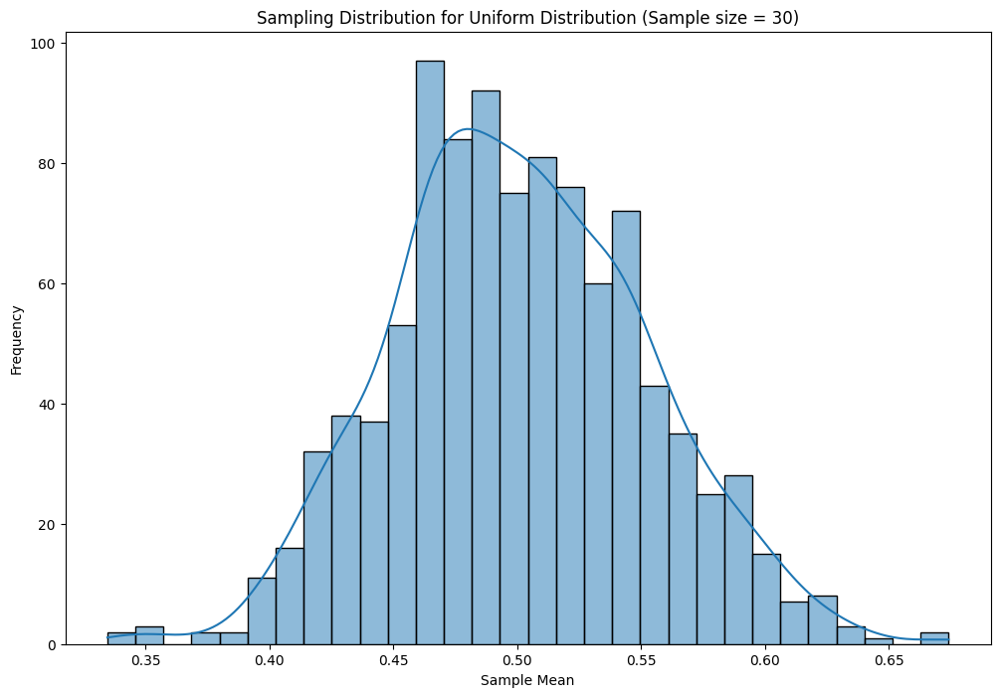

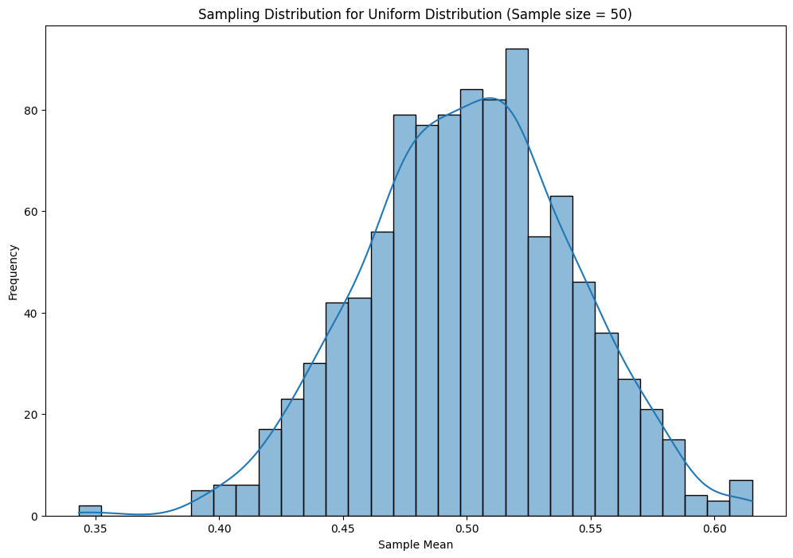

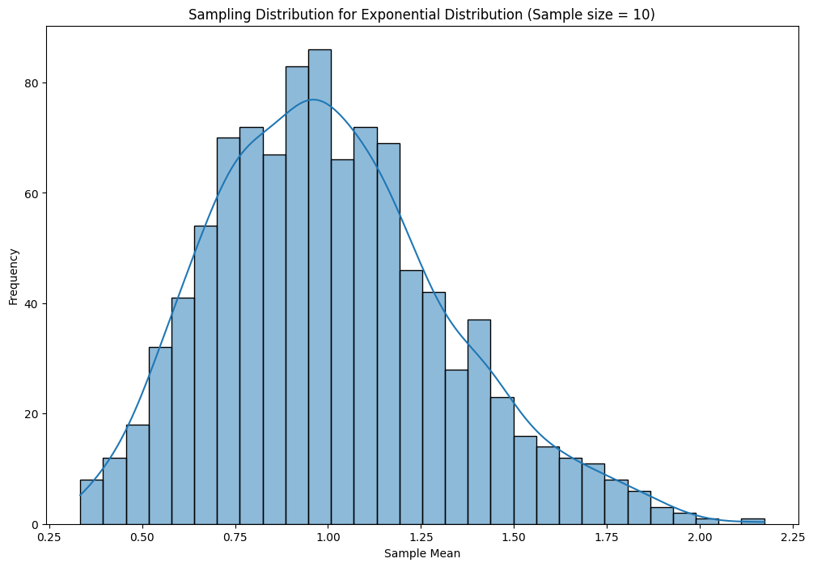

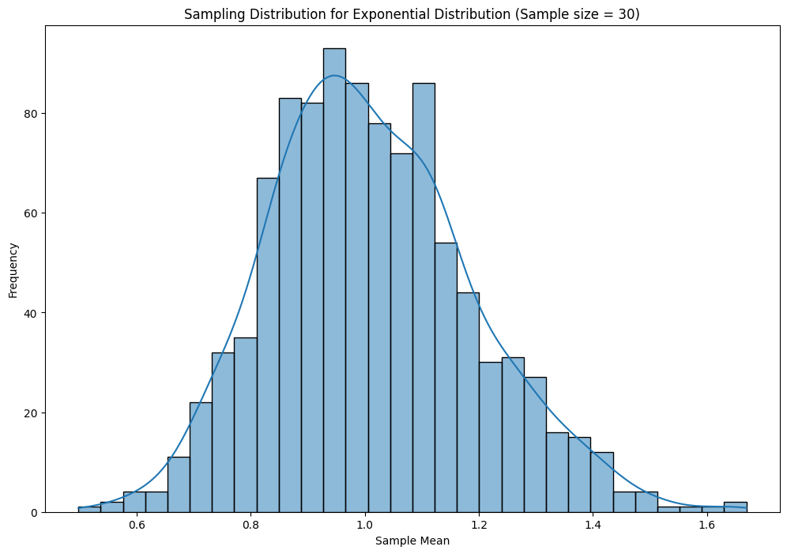

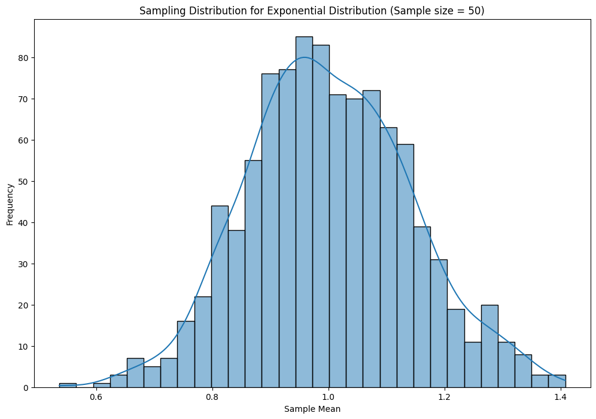

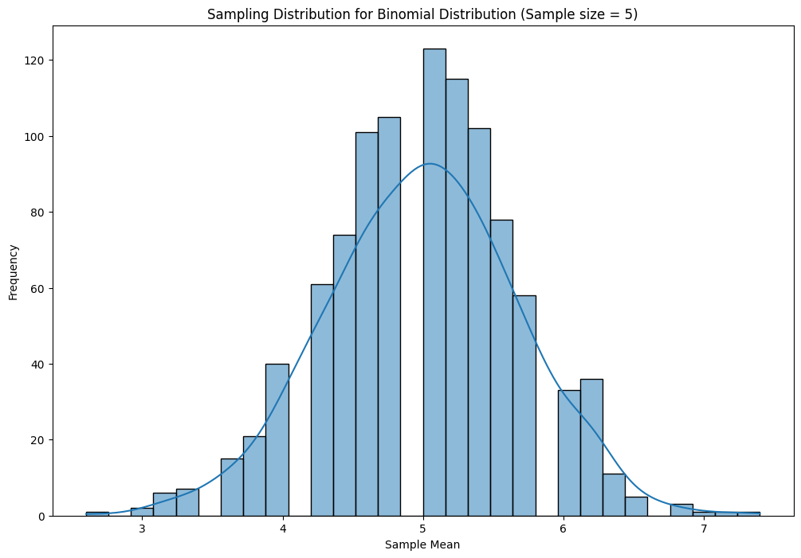

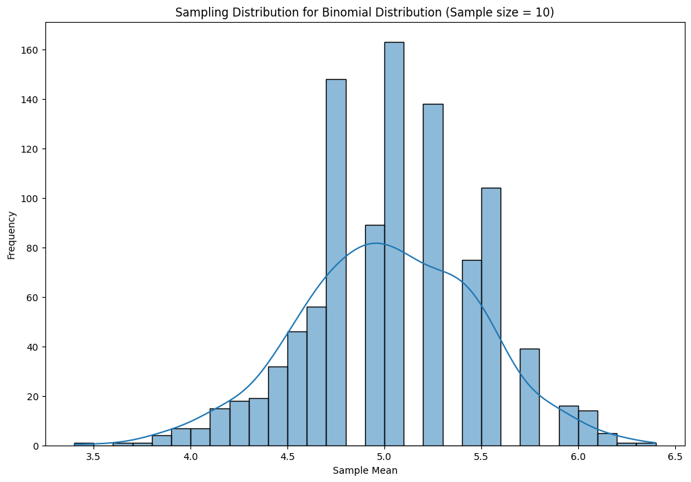

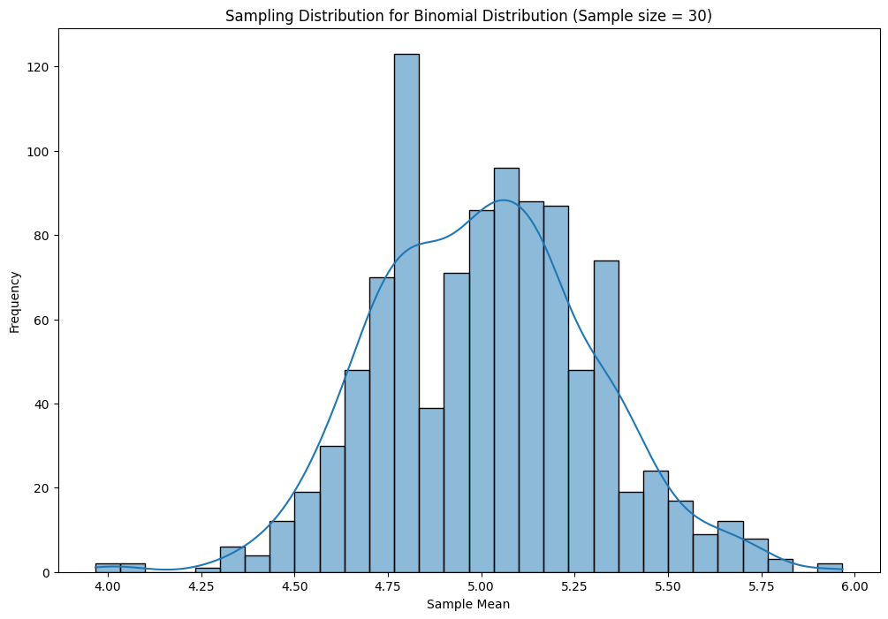

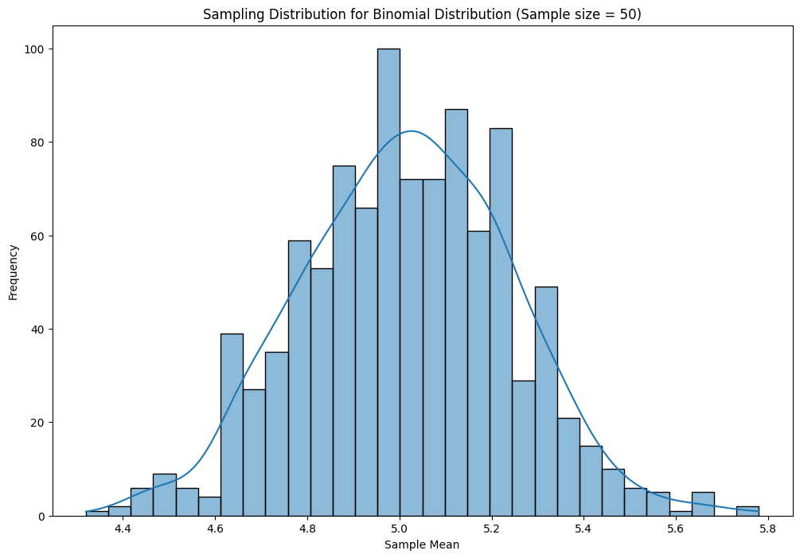