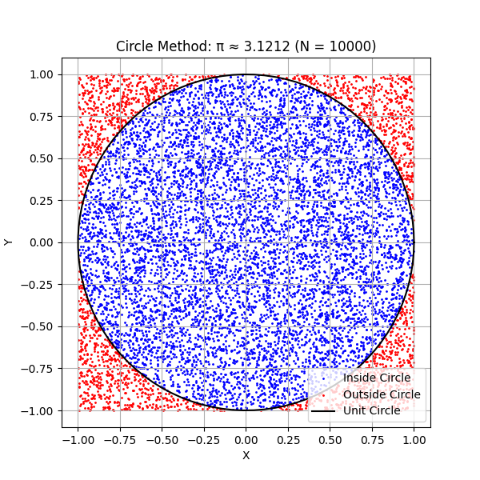
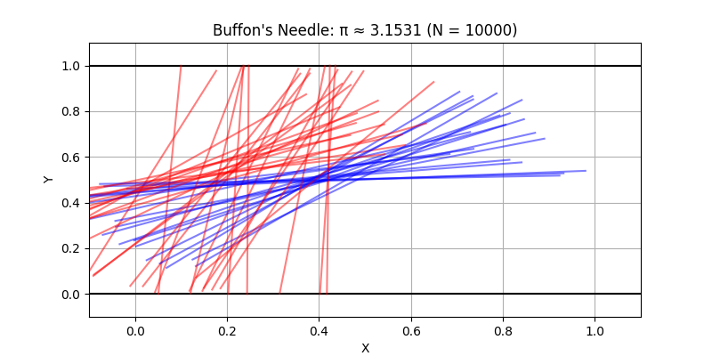

# Estimating $\pi$ with Monte Carlo Methods

Monte Carlo simulations are a powerful class of computational techniques that use randomness to solve problems or estimate values. One of the most elegant applications is estimating the value of $\pi$ using geometric probability.

This project connects probability, geometry, and numerical computation. It provides insight into convergence rates and computational efficiency, highlighting the versatility and simplicity of Monte Carlo methods.

---

## Part 1: Estimating $\pi$ Using a Circle

### 1. Theoretical Foundation

A unit circle (radius = 1) can be inscribed in a square with side length 2. The idea is to randomly generate points in the square and determine the fraction that fall inside the circle.

- Area of the circle: $A_{\text{circle}} = \pi r^2 = \pi$
- Area of the square: $A_{\text{square}} = 4$

The probability that a randomly chosen point lies inside the circle is:

$$
\frac{\text{Points inside circle}}{\text{Total points}} \approx \frac{\pi}{4} \Rightarrow \pi \approx 4 \times \frac{\text{Inside}}{\text{Total}}
$$

### Explanation of Monte Carlo Simulation with $N = 10000$

In this simulation, we randomly generated 10000 points uniformly distributed inside the square $[-1, 1] \times [-1, 1]$. Each point’s position was checked to see if it falls inside the unit circle defined by $x^2 + y^2 \leq 1$.

Because the area of the circle is $\pi$ (for radius 1) and the area of the square is 4, the ratio of points inside the circle to the total points approximates the ratio of their areas, i.e.,

the fraction $\frac{\text{Points inside circle}}{N}$ is approximately equal to $\frac{\pi}{4}$.

Using this, the value of $\pi$ is estimated by

$\pi \approx 4 \times \frac{\text{Points inside circle}}{N}$.

With $N=10000$, the estimate converges reasonably well to the true value of $\pi$, though some random fluctuation remains due to sampling variability. Increasing $N$ would improve accuracy by reducing this variability.

### Explanation of Buffon’s Needle Simulation with $N = 10000$

In this simulation, we dropped $N = 10000$ virtual needles of length $L = 1$ onto a plane with parallel lines spaced a distance $D = 2$ apart. For each drop, we randomly selected the angle $\theta$ between the needle and the lines (from $0$ to $\frac{\pi}{2}$), and the distance from the needle’s center to the nearest line.

A needle is considered to cross a line if the perpendicular distance from its center to the nearest line is less than or equal to $\frac{L}{2} \sin(\theta)$. We count how many needles cross a line, denoted as $n_{\text{crosses}}$.

Using Buffon’s formula, the probability of a needle crossing a line is $P = \frac{2L}{\pi D}$, which leads to the estimate:

$\pi \approx \frac{2L \cdot N}{D \cdot n_{\text{crosses}}}$.

With $N = 10000$ drops, this estimate of $\pi$ is based on the observed frequency of crossings. While it approximates $\pi$ reasonably well, this method generally converges more slowly than the circle-based method due to higher variability and sensitivity to angle distributions.

