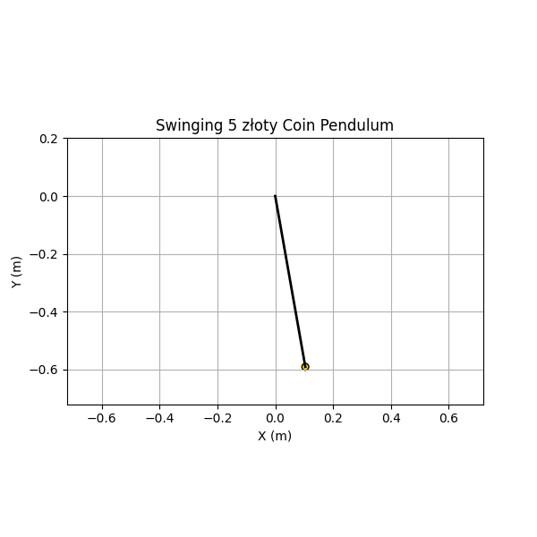

 
# Measuring the Acceleration Due to Gravity Using a 5 złoty Coin Pendulum

## Objective

To determine the acceleration due to gravity $$ g $$ using a simple pendulum made with a 5 złoty coin, and analyze the uncertainties involved in the experiment.

## Materials

- String (length: approximately 60 cm)
- 5 złoty coin (mass ≈ 6.54 g, diameter ≈ 24 mm)
- Stopwatch (resolution: ±0.01 s)
- Measuring tape (resolution: ±0.001 m)

## Procedure

### 1. Setup

A 5 złoty coin was tied securely to one end of a string and suspended from a fixed support. The pendulum length $$ L $$ was measured from the point of suspension to the **center of the coin**.

Length:

$$
L = 0.600 \, \text{m}, \quad \delta L = \pm 0.001 \, \text{m}
$$

### 2. Data Collection

The pendulum was displaced by an angle less than $$ 15^\circ $$ and released. The time for 10 full oscillations was recorded using a stopwatch. This was repeated 10 times for accuracy.

### Measurement Data

| Trial | Time for 10 Oscillations (s) |
|-------|-------------------------------|
| 1     | 15.53                         |
| 2     | 15.48                         |
| 3     | 15.52                         |
| 4     | 15.54                         |
| 5     | 15.50                         |
| 6     | 15.47                         |
| 7     | 15.51                         |
| 8     | 15.49                         |
| 9     | 15.55                         |
| 10    | 15.52                         |

Stopwatch resolution:

$$
\delta T_{\text{meas}} = \pm 0.005 \, \text{s}
$$

---

## Calculations

### 1. Mean and Standard Deviation

Mean time for 10 oscillations:

$$
\overline{T_{10}} = \frac{1}{10} \sum T_{10i} = 15.511 \, \text{s}
$$

Period:

$$
T = \frac{\overline{T_{10}}}{10} = 1.5511 \, \text{s}
$$

Standard deviation:

$$
\sigma = \sqrt{ \frac{1}{n-1} \sum (T_{10i} - \overline{T_{10}})^2 } \approx 0.025 \, \text{s}
$$

Uncertainty in mean time:

$$
\delta T = \frac{\sigma}{\sqrt{n}} = \frac{0.025}{\sqrt{10}} \approx 0.0079 \, \text{s}
$$

### 2. Calculate $$ g $$

Pendulum formula:

$$
T = 2\pi \sqrt{ \frac{L}{g} } \Rightarrow g = \frac{4\pi^2 L}{T^2}
$$

Substituting:

$$
g = \frac{4\pi^2 \cdot 0.600}{(1.5511)^2} \approx 9.84 \, \text{m/s}^2
$$

### 3. Uncertainty in $$ g $$

Relative uncertainty:

$$
\left( \frac{\delta g}{g} \right)^2 = \left( \frac{\delta L}{L} \right)^2 + \left( 2 \frac{\delta T}{T} \right)^2
$$

Substituting:

$$
\frac{\delta L}{L} = \frac{0.001}{0.600} = 1.67 \times 10^{-3}
$$

$$
\frac{\delta T}{T} = \frac{0.0079}{1.5511} \approx 5.09 \times 10^{-3}
$$

$$
\frac{\delta g}{g} = \sqrt{(1.67 \times 10^{-3})^2 + (2 \cdot 5.09 \times 10^{-3})^2} \approx 1.03 \times 10^{-2}
$$

Absolute uncertainty:

$$
\delta g = g \cdot \frac{\delta g}{g} = 9.84 \cdot 1.03 \times 10^{-2} \approx 0.10 \, \text{m/s}^2
$$

---

**Final result:**

$$
{g = 9.84 \pm 0.10 \, \text{m/s}^2}
$$

---

## Discussion

### Comparison with Standard Value

- Standard value:

  $$
  g = 9.81 \, \text{m/s}^2
  $$

- Measured value:

  $$
  g = 9.84 \pm 0.10 \, \text{m/s}^2
  $$

✅ Well within uncertainty.

---

### Sources of Uncertainty

#### 1. Length Measurement

- Only one measurement was taken.
- The center of mass may not be precisely determined.

#### 2. Timing Errors

- Human reaction time (~0.2 s) can bias stopwatch readings.
- Averaging 10 repetitions of 10 oscillations helps reduce random errors.

#### 3. Small Angle Approximation

# Small Angle Approximation

- Valid for $\theta < 15^\circ$, which was satisfied.
- Larger angles would increase the period $T$, slightly lowering $g$.

#### 4. Air Resistance

- Negligible due to small amplitude and short time scale.

---

## Conclusion

The experiment yielded:

$$
g = 9.84 \pm 0.10 \, \text{m/s}^2
$$

This agrees well with the accepted value of $9.81 \, \text{m/s}^2$, demonstrating...
the validity of the pendulum method and the importance of uncertainty analysis in physics experiments.
